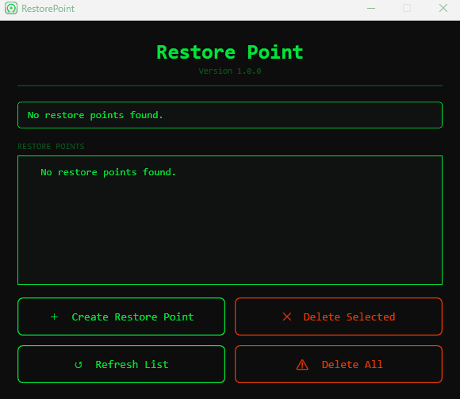

<h1 align="center">RestorePointGUI</h1>

<p align="center">
  A fast, lightweight Windows restore point manager built with WPF.
</p>

<p align="center">
  <a href="https://github.com/kevinz26/RestorePointGUI/releases/latest">
    
  </a>
</p>

<p align="center">
  
  
  
  
  
  
</p>

---

## 🚀 Install

### Recommended (Installer)
👉 [Releases---Latest](https://github.com/kevinz26/RestorePointGUI/releases/latest)

### Portable
Download the ZIP from Releases and run manually.

---

## 🎬 Demo

<p align="center">
  
</p>

---

## ✨ Features

- Create Windows system restore points
- Clean and simple WPF interface
- Lightweight and fast
- Installer + portable builds
- Native Windows integration

---

## 💬 Community

Have questions, ideas, or feedback?

👉 [Discussions](https://github.com/kevinz26/RestorePointGUI/discussions)
👉 [Feature Request](https://github.com/kevinz26/RestorePointGUI/issues)
👉 [Bug Report](https://github.com/kevinz26/RestorePointGUI/issues)

---

## 🛠 Build from Source

```powershell
dotnet restore
dotnet build -c Release
